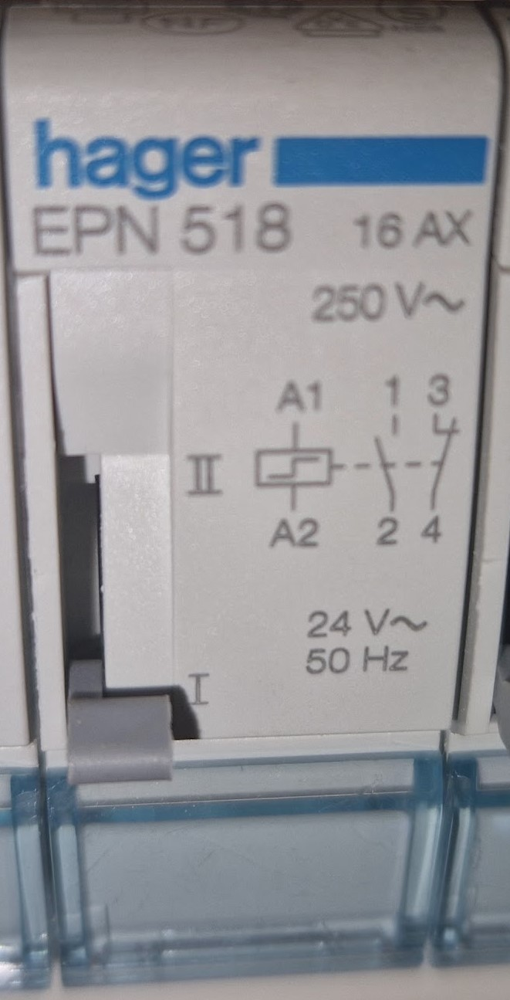
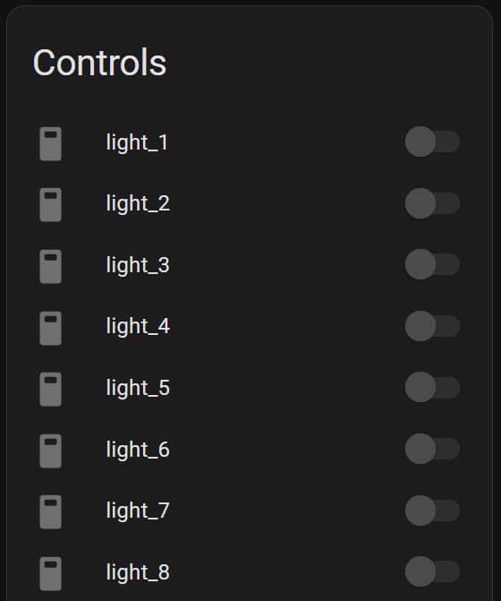

# Disclaimer

Have professional do the electrical wiring

# The problem

House comes with epn518, but you want to have smart lights.



To control the lights we need solution that can do following:
  - Detect 24 VAC voltage from epn518 pin 3 (NC pin to light up LED on low voltage switches)
    - This is to detect the current state of the relay
  - Send 24 VAC pulse to pin A1
    - This is to trigger change it the relay state

# Solution

ESP32SR88
  - provides 8x 30V outputs which work perfectly for sending 24 VAC pulses.
  - provides 8x optically isolated inputs for detecting 24 VAC

# Usage

In your esphome config include following

```
substitutions:
  hide_inputs: true
  hide_outputs: true

packages:
  remote_package:
    url: https://github.com/quasd/ESP32SR88_esphome_epn518_control/
    ref: main
    files:
      - switches.yaml
```

# Result

State of the switch should reflect the state of the relays and the switches can be used to change them.

By default the inputs and switches are hidden. Only "vitual light swithces" are shown. If you have any problems consider showing the inputs/outputs 

